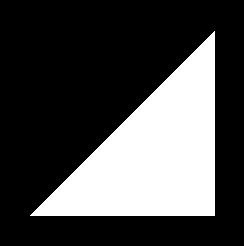

## Introduction

Recently I've pretty interested with computer graphics, so I've decided to start studying a little bit more about it by myself, since it's a topic that I'll probably not stumble upon in college or at work.

I've actually started studying this subject a while back with the Computer Graphics with Modern OpenGL and C++ course available [here](https://www.udemy.com/course/graphics-with-modern-opengl/).

For this series of posts I'llbe using the Learning Modern 3D Graphics Programming Book available [here](https://paroj.github.io/gltut/index.html). And I'll be sharing some of the stuff that is recomended in the further studies section of each chapter. The first one is called "Hello, Triangle!" and only shows some basic rendering stuff, like the use of buffers to render a triangle.

### Changing colors

The first task is to change the the color of the triangle that is originally displayed. At first it has a black background and a white color.



The color of the background is located inside the display function and should be set before the `glClear(GL_COLOR_BUFFER_BIT)` function, or else will have no effect.

```
	glClearColor(0.0f, 0.0f, 0.0f, 0.0f);
	glClear(GL_COLOR_BUFFER_BIT);
```

The four numbers inside the `glClearColor` function represent the red, green, blue and alpha of the color, so if I change the first numbr to `1.0f`, the background should be red.


Now, how to change the color of the triangle itself?

In this case the color of the triangleis being determined inside the fragment shader in the `outputColor` variable.

```
const std::string strFragmentShader(
	"#version 330\n"
	"out vec4 outputColor;\n"
	"void main()\n"
	"{\n"
	"   outputColor = vec4(1.0f, 1.0f, 1.0f, 1.0f);\n"
	"}\n"
);
```

Just like the background color, the four numbers inside the vec4 represent red, gree, blue and alpha, so if I change the first two numbers to `0.0f`, the triangle should be blue.


If you noticed, I've only used zeros and ones as parameters, this is because the color should be represented in a range from zero to one. If a number bigger than one is used, it will default to one, and if a number smaller than zero is used it will default to zero.

### Changing positions

To change the position of the triangle, we should change the position of every point that defines it's shape. These positions are declared inside the `InitializeProgram` function in the `vertexPositions` variable.

```
const float vertexPositions[] = {
	0.75f, 0.75f, 0.0f, 1.0f,
	0.75f, -0.75f, 0.0f, 1.0f,
	-0.75f, -0.75f, 0.0f, 1.0f,
};
```

Each point is defined by four values, the x, y and z positions and the w value(this is norimportant for now). The x and y values range from -1 to 1 where the (0, 0) values are in the middle of the screen, the z value ranges from 0 to 1.

To demonstrate what happens I'll invert the second point to the values -0.75f, 0.75f, 0.0f, 1.0f.


Since I've changed one of the points position, know it looks like the triangle is upside down.

### Changing the ammount of vertices

For know we have only been using three vertices to display a triangle. What if we want to render a square?

To do this we will be creating a second triangle of the same color to make the figure look like a square.

First we need to create new points in the `vertexPositions` variable:

```
const float vertexPositions[] = {
	0.75f, 0.75f, 0.5f, 1.0f,
	-0.75f, 0.75f, 0.0f, 1.0f,
	-0.75f, -0.75f, 0.0f, 1.0f,
	0.75f, 0.75f, 0.5f, 1.0f,
	0.75f, -0.75f, 0.0f, 1.0f,
	-0.75f, -0.75f, 0.0f, 1.0f,
};
```

But if you try to render this, nothing will change. You'll need to make a change in the `glDrawArrays` function inside the `display` function. Currently it looks like this:

```
glDrawArrays(GL_TRIANGLES, 0, 3);
```

The first parameter of the function tells the renderer that we will be drawing triangles, the second one tells the renderer the position index in which we should start rendering in the `vertexPositions` variable and the last parameter tells the renderer how many points should we consider from the first one. So currently we are drawing 3 points starting at the position 0.

To make our square render all we need to do is change the value of the last parameter to 6, since know we need to render 6 points.

```
glDrawArrays(GL_TRIANGLES, 0, 6);
```


